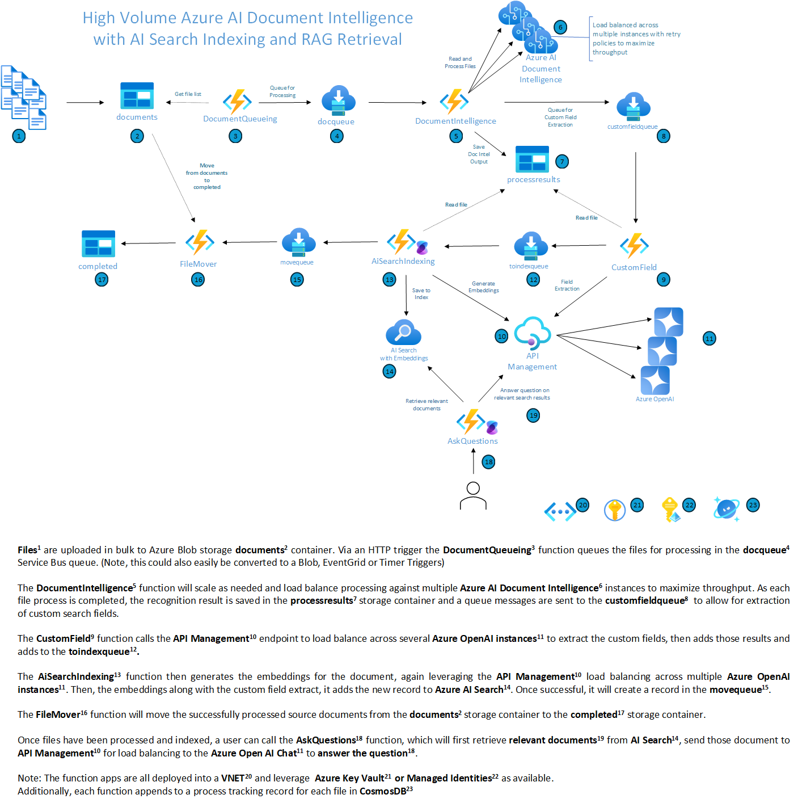

# High Volume Azure AI Document Intelligence with AI Search Indexing

This repository is offered to demonstrate a set of resources that will allow you to leverage [Azure AI Document Intelligence](https://learn.microsoft.com/en-us/azure/ai-services/document-intelligence/?view=doc-intel-4.0.0) for high throughput of processing documents stored in Azure Blob Storage to extract text. It then utilized Semantic Kernel, Azure OpenAI and Azure AI Search to index the contents of these documents. The solution can be used to process documents in a variety of formats, including Office documents, PDF, PNG, and JPEG.

**IMPORTANT!** In addition to leveraging the solution below with multiple Document Intelligence instances, it will be beneficial to _request a transaction limit increase_ for your Document Intelligence Accounts. Instructions for how to do this can be found in the [Azure AI Document Intelligence Documentation](https://docs.microsoft.com/en-us/azure/applied-ai-services/form-recognizer/service-limits#increasing-transactions-per-second-request-limit)

## Architecture and Process Overview



## Feature Details

This solution leverages the following Azure services:

- **[Azure AI Document Intelligence](https://learn.microsoft.com/en-us/azure/ai-services/document-intelligence/?view=doc-intel-4.0.0)** - the Azure AI Service API that will perform the document intelligence, extraction and processing.

- **[Azure OpenAI](https://azure.microsoft.com/en-us/products/ai-services/openai-service)** - the Azure AI Service API that will perform the semantic embedding calculations of the extracted text.
- **[Azure API Management](https://learn.microsoft.com/en-us/azure/api-management/)** - used to load balance across multiple Azure OpenAI instances
- **[Azure AI Search](https://learn.microsoft.com/en-us/azure/search/search-what-is-azure-search)** - the Azure AI Service that will index the extracted text for search and analysis.

- **[Azure Blob Storage](https://learn.microsoft.com/en-us/azure/storage/blobs/storage-blobs-introduction)** with three containers
  - `documents` - starting location to perform your bulk upload of documents to be processed
  - `processresults`  - the extracted text output from the Document Intelligence service
  - `completed` - location where the original documents are moved to once successfully processed by Document Intelligence
four
- **[Azure Service Bus](https://learn.microsoft.com/en-us/azure/service-bus-messaging/)** with four queues
  - `docqueue` - this contains the messages for the files that need to be processed by the Document Intelligence service
  - `customfieldqueue` - this contains messages for the files that need to have custom field extraction compelted
  - `toindexqueue` - this contains the messages for the files that have been processed by the Document Intelligence service and the reults are ready to be indexed by Azure AI Search
  - `movequeue` - this contains the messages for the files that have been processed by the Document Intelligence service and are ready to be moved to the `completed` blob container
- **[Azure Functions](https://learn.microsoft.com/en-us/azure/azure-functions/functions-overview?pivots=programming-language-csharp)**
  - `DocumentQueueing` - identifies the files in the `document` blob container and send a claim check message (containing the file name) to the `docqueue` queue. This function is triggered by an HTTP call, but could also be modified to use a Blob Trigger
  - `DocumentIntelligence` - processes the message in `docqueue` to Document Intelligence, then updates Blob metadata as "processed" and create new message in `customfieldqueue` \
    This function employs scale limiting and [Polly](https://github.com/App-vNext/Polly) retries with back off for Document Intelligence (too many requests) replies to balance maximum throughput and overloading the API endpoint
  - `CustomFieldExtraction` - processes messages in the `customfieldqueue` to use Azure Open AI to extract custom fields based on the `AzureUtilities/Prompts/ExtractCustomFields.yaml` prompt description. Once complete, create new message in `toindexqueue`
  - `AiSearchIndexing` - processes messages in the `toindexqueue` to get embeddings of the extracted text from Azure Open AI and saves those embeddings to Azure AI Search.  Once complete, create new message in `movequeue`
  - `FileMover` - processes messages in the `movequeue` to move files from `document` to `completed` blob containers
  - `AskQuestions` - simple HTTP function to demonstrate RAG retrieval by allowing you to ask questions on the indexed documents

### Multiple Document Intelligence endpoints

To further allow for high throughput, the `DocumentIntelligence` function can distribute processing between 1-10 separate Document Intelligence accounts. This is managed by the `docqueue` funtion automatically adding a `RecognizerIndex` value of 0-9 when queueing the files for processing. 

The DocumentIntelligence function will distribute the files to the appropriate account (regardless of the number of Document Intelligence accounts actually provisioned).

To configure multiple Document Intelligence accounts with the script below, add a value between 1-10 for the `-docIntelligenceInstanceCount` (default is 1). To configure manually, you will need to add all of the Document Intelligence account keys to the Azure Key Vault's `DOCUMENT-INTELLIGENCE-KEY` secret -- _pipe separated_

_Assumption:_ all instances of the Document Intelligence share the same URL (such as: https://eastus.api.cognitive.microsoft.com/)

### Multiple Azure OpenAI endpoints

In a similar way with Document Intelligence, to ensure high throughput, you can deploy multiple Azure OpenAI accounts. To assist in load balancing, the accounts are front-ended with Azure API Management which handled the load balancing and circuit breaker should an instance get overloaded.


## Get Started

To try out the sample end-to-end process, you will need:

- An Azure subscription that you have privileges to create resources.
- Deployment is automated using PowerShell, the [Azure CLI](https://learn.microsoft.com/en-us/cli/azure/) and the [Azure Developer CLI](https://learn.microsoft.com/en-us/azure/developer/azure-developer-cli/). These can be easily installed on a Windows machine using `winget`:

``` bash
winget install --id "Microsoft.AzureCLI" --silent --accept-package-agreements --accept-source-agreements
winget install --id "Microsoft.Azd" --silent --accept-package-agreements --accept-source-agreements
```


### Running deployment script

1. **IMPORTANT**: Open and edit the `main.parameters.json` file found in the `infra` folder. This file will contain the information needed to properly deploy the API Management and Azure OpenAI accounts:

    - **APIM settings**
      - `apiManagementPublisherEmail` - will default to current user email. Remove environment variable reference to set manually.
      - `apiManagementPublisherName` - will default to current user name. Remove environment variable reference to set manually.

    - **Azure OpenAI model settings**

      - `azureOpenAIEmbeddingModel` - embedding model you will use to generate the embeddings
      - `azureOpenAIChatModel` - the chat/completions model to use

    - **Azure OpenAI deployment settings**

        For each deployment you want to create, add an object type type as per the example below (note `name` is optional).

        ``` json
      "openAiConfigs": {
      "value": 
      {
        "embeddingModel" : "text-embedding-ada-002",
        "embeddingMaxTokens" : 8191,
        "completionModel" : "gpt-4o",
        "configs" :     [
          {
            "name": "",
            "location": "eastus2",
            "suffix": "eastus2",
            "priority": 1,
            "embedding": {
              "capacity": 100        
            },
            "completion": {
              "capacity": 100, 
              "sku" : "GlobalStandard"            
            }
          },
          {
            "name": "",
            "location": "westus",
            "suffix": "westus",
            "priority": 2,
            "embedding": {
              "capacity": 100
            },
            "completion": {
              "capacity": 100, 
              "sku" : "GlobalStandard"            
            }
          }
        ]
      }
        ```

2. Login to the Azure Develper CLI:  `azd auth login` (note: if you have access to multiple Entra tenants, you may need to add the flag `--tenant-id` with the GUID value for the desired tenant )
3. Run the azd command

    ``` PowerShell
    azd up
    ```

The first time you run this, you will be prompted for several values. This command will create all of the Azure resources and RBAC role assignments needed for the demonstration.

### Running a demonstration

To exercise the code and run the demo, follow these steps:


1. Upload sample file to the storage account's `documents` container. To help with this, you can try the supplied PowerShell script [`BulkUploadAndDuplicate.ps1`](Scripts/BulkUploadAndDuplicate.ps1). This script will take a directory of local files and upload them to the storage container. Then, based on your settings, duplicate them to help you easily create a large library of files to process

    ```Powershell
    .\BulkUploadAndDuplicate.ps1 -path "<path to dir with sample file>" -storageAccountName "<storage account name>" -containerName "documents" -counterStart 0 -duplicateCount 10
    ```

    The sample script above would would upload all of the files found in the `-path` directory, then create copies of them prefixed with 000000 through 000010. You can of course upload the files any way you see fit.

2. In the Azure portal, navigate to the resource group that was created and locate the function with the `Queueing` in the name. Then select the Functions list and select the function method `DocumentQueueing`. In the "Code + Test" link, select Test/Run and hit "Run" (no query parameters are needed). This will kick off the queueing process for all of the files in the `documents` storage container. The output will be the number of files that were queued.

3. Once messages start getting queued, the `DocumentIntelligence` function will start picking up the messages and begin processing. You should see the number of messages in the `docqueue` queue go down as they are successfully processed. You will also see new files getting created in the `processresults` container.

4. Simultaneously, as the `DocumentIntelligence` function completes it's processing and queues messages in the `docqueue` queue, the `AiSearchIndexing` function will start picking up messages in the `toindexqueue` and sent the extracted text in the `processresults` container to Azure OpenAI for embedding calculation and then Azure AI Search for indexing. Also the `Mover` function will begin picking up those messages and moving the processed files from the `processed` container into the `completed` container.

5. You can review the execution and timings of the end to end process

6. Use the `AskQuestions` function to demonstrate RAG retrieval of the index documents.

## References

- [Smart load balancing for OpenAI endpoints and Azure API Management](https://techcommunity.microsoft.com/t5/fasttrack-for-azure/smart-load-balancing-for-openai-endpoints-and-azure-api/ba-p/3991616) (priority load balancing)
- [Using Azure API Management Circuit Breaker and Load balancing with Azure OpenAI Service](https://techcommunity.microsoft.com/t5/fasttrack-for-azure/using-azure-api-management-circuit-breaker-and-load-balancing/ba-p/4041003) (round robin load balancing)
- [Azure OpenAI Service Load Balancing with Azure API Management](https://github.com/Azure-Samples/azure-openai-apim-load-balancing) (round robin load balancing)